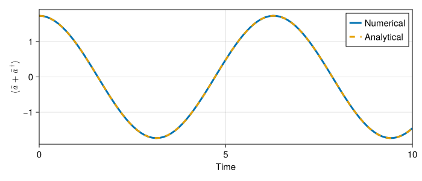
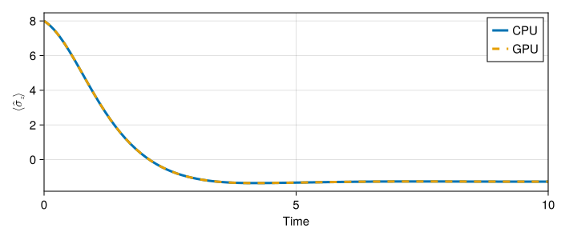

# QuantumToolbox.jl
Alberto Mercurio

## Introduction

[QuantumToolbox.jl](https://github.com/qutip/QuantumToolbox.jl) was born
during my Ph.D., driven by the need for a high-performance framework for
quantum simulations. At the time, I was already using
[QuTiP](https://github.com/qutip/qutip) (Quantum Toolbox in Python).

<iframe src="https://qutip.org" width="100%" height="500px"></iframe>

However, I was looking for a more efficient solution. I initially
explored
[QuantumOptics.jl](https://github.com/qojulia/QuantumOptics.jl), but its
syntax differed significantly from QuTiP’s, which made the transition
challenging. Motivated by the desire for both performance and
familiarity, as well as a deep curiosity to learn Julia, I decided to
develop my own package.

## A Demo Code: the Schrödinger Equation

Let’s consider a quantum harmonic oscillator with Hamiltonian
($\hbar = 1$)

$$
\hat{H} = \omega_0 \hat{a}^\dagger \hat{a} \, ,
$$

and start from the state

$$
\left| \psi(0) \right\rangle = \frac{1}{\sqrt{2}} \left( \left| 2 \right\rangle + \left| 3 \right\rangle \right) \, .
$$

We now want to solve the Schrödinger equation

$$
i \frac{d}{dt} \left| \psi(t) \right\rangle = \hat{H} \left| \psi(t) \right\rangle \, .
$$

This can easily be done with QuTiP using the `sesolve` function. We also
want to compute the expectation value of the position operator

$$
\left\langle \hat{a} + \hat{a}^\dagger \right\rangle (t) = \left\langle \psi(t) \right| \hat{a} + \hat{a}^\dagger \left| \psi(t) \right\rangle \, .
$$

An analytical solution is known,

$$
\vert \psi (t) \rangle = \frac{1}{\sqrt{2}} \left( e^{-i 2 \omega_0 t} \vert 2 \rangle + e^{-i 3 \omega_0 t} \vert 3 \rangle \right) \, ,
$$

and so

$$
\langle \hat{a} + \hat{a}^\dagger \rangle (t) = \sqrt{3} \cos (\omega_0 t) \, ,
$$

and we can compare the numerical results with it.

### The QuTiP case

``` python
import numpy as np
from qutip import *

N = 10 # cutoff for Fock states
a = destroy(N)
H = a.dag() * a

psi0 = (fock(N, 2) + fock(N, 3)).unit()
tlist = np.linspace(0, 10, 100)
e_ops = [a + a.dag()]

result = sesolve(H, psi0, tlist, e_ops=e_ops)
```

### QuantumToolbox.jl: Almost the same syntax

``` julia
using QuantumToolbox

N = 10
a = destroy(N)
H = a' * a

psi0 = (fock(N, 2) + fock(N, 3)) |> normalize
tlist = range(0, 10, 100)
e_ops = [a + a']

result = sesolve(H, psi0, tlist, e_ops=e_ops)
```

    Progress: [==============================] 100.0% --- Elapsed Time: 0h 00m 00s (ETA: 0h 00m 00s)

    Solution of time evolution
    (return code: Success)
    --------------------------
    num_states = 1
    num_expect = 1
    ODE alg.: OrdinaryDiffEqTsit5.Tsit5{typeof(OrdinaryDiffEqCore.trivial_limiter!), typeof(OrdinaryDiffEqCore.trivial_limiter!), Static.False}(OrdinaryDiffEqCore.trivial_limiter!, OrdinaryDiffEqCore.trivial_limiter!, static(false))
    abstol = 1.0e-8
    reltol = 1.0e-6

And we can plot the results using
[Makie.jl](https://github.com/MakieOrg/Makie.jl) for example

``` julia
using CairoMakie

fig = Figure(size=(700, 300), fontsize=15)
ax = Axis(fig[1, 1], xlabel="Time", ylabel=L"\langle \hat{a} + \hat{a}^\dagger \rangle")

lines!(ax, result.times, real.(result.expect[1,:]), linewidth=3, label="Numerical")
lines!(ax, result.times, sqrt(3) .* cos.(result.times), linewidth=3, label="Analytical", linestyle=:dash)

xlims!(ax, result.times[1], result.times[end])

axislegend(ax)

fig
```



## The `QuantumObject` struct

If we take a look at the structure of the annihilation operator
$\hat{a}$, we can see that it is a
[`QuantumObject`](https://qutip.org/QuantumToolbox.jl/stable/resources/api#QuantumToolbox.QuantumObject)
Julia constructor.

``` julia
typeof(a)
```

    QuantumObject{SparseMatrixCSC{ComplexF64, Int64}, OperatorQuantumObject, 1}

``` julia
a
```

    Quantum Object:   type=Operator   dims=[10]   size=(10, 10)   ishermitian=false
    10×10 SparseMatrixCSC{ComplexF64, Int64} with 9 stored entries:
         ⋅      1.0+0.0im          ⋅      …          ⋅          ⋅    
         ⋅          ⋅      1.41421+0.0im             ⋅          ⋅    
         ⋅          ⋅              ⋅                 ⋅          ⋅    
         ⋅          ⋅              ⋅                 ⋅          ⋅    
         ⋅          ⋅              ⋅                 ⋅          ⋅    
         ⋅          ⋅              ⋅      …          ⋅          ⋅    
         ⋅          ⋅              ⋅                 ⋅          ⋅    
         ⋅          ⋅              ⋅         2.82843+0.0im      ⋅    
         ⋅          ⋅              ⋅                 ⋅      3.0+0.0im
         ⋅          ⋅              ⋅                 ⋅          ⋅    

A `QuantumObject` struct is defined as follows

``` julia
struct QuantumObject{MT<:AbstractArray,ObjType<:QuantumObjectType,N} <: AbstractQuantumObject{MT,ObjType,N}
    data::MT
    type::ObjType
    dims::SVector{N,Int}
end
```

The `data` field contains the actual data of the quantum object, in this
case it is a sparse matrix. This follows from the definition of the
matrix elements of the annihilation operator

$$
\langle n \vert \hat{a} \vert m \rangle = \sqrt{m} \ \delta_{n, m-1} \, ,
$$

where we defined $N$ as the cutoff for the Fock states. The `type` field
gives the type of the quantum object

- `Ket` for ket states
- `Bra` for bra states
- `Operator` for operators
- `SuperOperator` for superoperators (e.g., Liouvillian)
- `OperatorKet` for vectorized representation of operators, acting as a
  ket state
- `OperatorBra` for vectorized representation of operators, acting as a
  bra state

Finally, the `dims` field contains the list of dimensions of the Hilbert
spaces. Its length is equal to the number of subsystems, and each
element is the dimension of the corresponding subsystem.

## Large Hilbert Spaces: The Need for GPU Acceleration

The example above was quite simple, where an analytical solution was
known. However, in many cases, the system is more complex and even the
numerical solution can be challenging. For instance, the Hilbert space
dimension can be very large when considering many subsystems. Let’s make
a practical example by considering a transverse field Ising model with
10 spins. The Hamiltonian is given by

<span id="eq-transverse-field-ising">$$
\hat{H} = \frac{J_z}{2} \sum_{\langle i,j \rangle} \hat{\sigma}_i^z \hat{\sigma}_j^z + h_x \sum_i \hat{\sigma}_i^x \, ,
 \qquad(1)$$</span>

where $\hat{\sigma}_i^z$ and $\hat{\sigma}_i^x$ are the Pauli matrices
acting on the $i$-th spin and, since we are including losses, the time
evolution of the density matrix is governed by the Lindblad master
equation

<span id="eq-master-equation">$$
\frac{d}{d t} \hat{\rho} = \mathcal{L}[\hat{\rho}] = -i[\hat{H}, \hat{\rho}] + \sum_k \left( \hat{L}_k \hat{\rho} \hat{L}_k^\dagger - \frac{1}{2} \{\hat{L}_k^\dagger \hat{L}_k, \hat{\rho}\} \right) \, ,
 \qquad(2)$$</span>

with the dissipators

<span id="eq-transverse-field-ising-dissipators">$$
\hat{L}_k = \sqrt{\gamma} \hat{\sigma}_k^- \, ,
 \qquad(3)$$</span>

where $\hat{\sigma}_k^-$ is the lowering operator acting on the $k$-th
spin, and $\gamma$ the decay rate.

``` julia
N = 10 # Total number of spins
Jz = 1.0
hx = 0.5
γ = 0.1

σx = sigmax()
σz = sigmaz()
σm = sigmam()

# Efficient way to generate the operator on the i-th spin
function op_i(op, i, ::Val{N}) where N
    data = kron(qeye(2^(i-1)).data, op.data, qeye(2^(N-i)).data)
    type = Operator
    dims = ntuple(x -> 2, Val(N))

    return Qobj(data, type = type, dims = dims)
end

H = Jz / 2 * mapreduce(i -> op_i(σz, i, Val(N)) * op_i(σz, i + 1, Val(N)), +, 1:N-1) + hx * mapreduce(i -> op_i(σx, i, Val(N)), +, 1:N)
```

    Quantum Object:   type=Operator   dims=[2, 2, 2, 2, 2, 2, 2, 2, 2, 2]   size=(1024, 1024)   ishermitian=true
    1024×1024 SparseMatrixCSC{ComplexF64, Int64} with 11264 stored entries:
    ⎡⣿⣿⣾⢦⡀⠳⣄⠀⠀⠀⠳⣄⠀⠀⠀⠀⠀⠀⠀⠀⠳⣄⠀⠀⠀⠀⠀⠀⠀⠀⠀⠀⠀⠀⠀⠀⠀⠀⠀⠀⎤
    ⎢⠺⣟⢻⣶⣿⡂⠈⠳⣄⠀⠀⠈⠳⣄⠀⠀⠀⠀⠀⠀⠀⠈⠳⣄⠀⠀⠀⠀⠀⠀⠀⠀⠀⠀⠀⠀⠀⠀⠀⠀⎥
    ⎢⢤⡈⠻⠻⠿⣧⣤⣠⡈⠳⠄⠀⠀⠈⠳⣄⠀⠀⠀⠀⠀⠀⠀⠈⠳⣄⠀⠀⠀⠀⠀⠀⠀⠀⠀⠀⠀⠀⠀⠀⎥
    ⎢⠀⠙⢦⡀⠀⣻⣿⣿⣙⣦⡀⠀⠀⠀⠀⠈⠳⣄⠀⠀⠀⠀⠀⠀⠀⠈⠳⣄⠀⠀⠀⠀⠀⠀⠀⠀⠀⠀⠀⠀⎥
    ⎢⠀⠀⠀⠙⢦⡈⠳⣼⣿⣿⡆⠀⠀⠀⠀⠀⠀⠈⠳⣄⠀⠀⠀⠀⠀⠀⠀⠈⠳⣄⠀⠀⠀⠀⠀⠀⠀⠀⠀⠀⎥
    ⎢⠙⢦⡀⠀⠀⠁⠀⠈⠈⠉⣿⣿⣾⢦⡀⠳⣄⠀⠀⠈⠀⠀⠀⠀⠀⠀⠀⠀⠀⠈⠳⣄⠀⠀⠀⠀⠀⠀⠀⠀⎥
    ⎢⠀⠀⠙⢦⡀⠀⠀⠀⠀⠀⠺⣟⢻⣶⣿⡂⠈⠳⣄⠀⠀⠀⠀⠀⠀⠀⠀⠀⠀⠀⠀⠈⠳⣄⠀⠀⠀⠀⠀⠀⎥
    ⎢⠀⠀⠀⠀⠙⢦⡀⠀⠀⠀⢤⡈⠻⠻⠿⣧⣤⣠⡈⠳⠀⠀⠀⠀⠀⠀⠀⠀⠀⠀⠀⠀⠀⠈⠳⣄⠀⠀⠀⠀⎥
    ⎢⠀⠀⠀⠀⠀⠀⠙⢦⡀⠀⠀⠙⢦⡀⠀⣻⣿⣿⣙⣦⠀⠀⠀⠀⠀⠀⠀⠀⠀⠀⠀⠀⠀⠀⠀⠈⠳⣄⠀⠀⎥
    ⎢⠀⠀⠀⠀⠀⠀⠀⠀⠙⢦⡀⠀⠀⠙⢦⡈⠳⣼⣿⣿⠀⠀⠀⠀⠀⠀⠀⠀⠀⠀⠀⠀⠀⠀⠀⠀⠀⠈⠳⣄⎥
    ⎢⠙⢦⡀⠀⠀⠀⠀⠀⠀⠀⠀⠀⠀⠀⠀⠀⠀⠀⠀⠀⣿⣿⡟⢦⡈⠳⣄⠀⠀⠈⠳⣄⠀⠀⠀⠀⠀⠀⠀⠀⎥
    ⎢⠀⠀⠙⢦⡀⠀⠀⠀⠀⠀⠀⠀⠀⠀⠀⠀⠀⠀⠀⠀⠻⣍⣿⣿⣯⠀⠈⠳⣄⠀⠀⠈⠳⣄⠀⠀⠀⠀⠀⠀⎥
    ⎢⠀⠀⠀⠀⠙⢦⡀⠀⠀⠀⠀⠀⠀⠀⠀⠀⠀⠀⠀⠀⢦⡈⠋⠛⢻⣶⣦⣦⡈⠓⠀⠀⠀⠈⠳⣄⠀⠀⠀⠀⎥
    ⎢⠀⠀⠀⠀⠀⠀⠙⢦⡀⠀⠀⠀⠀⠀⠀⠀⠀⠀⠀⠀⠀⠙⢦⡀⠨⣿⠿⣧⣽⡦⠀⠀⠀⠀⠀⠈⠳⣄⠀⠀⎥
    ⎢⠀⠀⠀⠀⠀⠀⠀⠀⠙⢦⡀⠀⠀⠀⠀⠀⠀⠀⠀⠀⡀⠀⠀⠙⢦⠈⠳⡿⣿⣿⣀⡀⡀⠀⢀⠀⠀⠈⠳⣄⎥
    ⎢⠀⠀⠀⠀⠀⠀⠀⠀⠀⠀⠙⢦⡀⠀⠀⠀⠀⠀⠀⠀⠙⢦⡀⠀⠀⠀⠀⠀⠀⠸⣿⣿⡟⢦⡈⠳⣄⠀⠀⠀⎥
    ⎢⠀⠀⠀⠀⠀⠀⠀⠀⠀⠀⠀⠀⠙⢦⡀⠀⠀⠀⠀⠀⠀⠀⠙⢦⡀⠀⠀⠀⠀⠈⠻⣍⣿⣿⣯⠀⠈⠳⣄⠀⎥
    ⎢⠀⠀⠀⠀⠀⠀⠀⠀⠀⠀⠀⠀⠀⠀⠙⢦⡀⠀⠀⠀⠀⠀⠀⠀⠙⢦⡀⠀⠀⠐⢦⡈⠋⠛⢻⣶⣦⣦⡈⠓⎥
    ⎢⠀⠀⠀⠀⠀⠀⠀⠀⠀⠀⠀⠀⠀⠀⠀⠀⠙⢦⡀⠀⠀⠀⠀⠀⠀⠀⠙⢦⡀⠀⠀⠙⢦⡀⠨⣿⠿⣧⣽⡦⎥
    ⎣⠀⠀⠀⠀⠀⠀⠀⠀⠀⠀⠀⠀⠀⠀⠀⠀⠀⠀⠙⢦⠀⠀⠀⠀⠀⠀⠀⠀⠙⢦⠀⠀⠀⠙⢦⠈⠳⡿⣿⣿⎦

``` julia
c_ops = mapreduce(i -> sqrt(γ) * op_i(σm, i, Val(N)), vcat, 1:N);
```

### The vectorized representation of the density matrix

The Liouvillian $\mathcal{L}$ is a superoperator, meaning that it acts
on operators. A convenient way to represent its action on $\hat{\rho}$
is by vectorizing the density matrix

$$
\hat{\rho} =
\begin{pmatrix}
\rho_{11} & \rho_{12} & \cdots & \rho_{1N} \\
\rho_{21} & \rho_{22} & \cdots & \rho_{2N} \\
\vdots & \vdots & \ddots & \vdots \\
\rho_{N1} & \rho_{N2} & \cdots & \rho_{NN}
\end{pmatrix}
\rightarrow
\begin{pmatrix}
\rho_{11} \\
\rho_{21} \\
\vdots \\
\rho_{N1} \\
\rho_{12} \\
\rho_{22} \\
\vdots \\
\rho_{N2} \\
\vdots \\
\rho_{1N} \\
\rho_{2N} \\
\vdots \\
\rho_{NN}
\end{pmatrix} \, .
$$

In this framework, the Liouvillian is represented by a matrix, and it is
generally used when solving the master equation in
<a href="#eq-master-equation" class="quarto-xref">Equation 2</a>.

``` julia
L = liouvillian(H, c_ops)
```

    Quantum Object:   type=SuperOperator   dims=[2, 2, 2, 2, 2, 2, 2, 2, 2, 2]   size=(1048576, 1048576)
    1048576×1048576 SparseMatrixCSC{ComplexF64, Int64} with 24641535 stored entries:
    ⎡⣿⣿⣾⢦⡀⠳⣄⠀⠀⠀⠳⣄⠀⠀⠀⠀⠀⠀⠀⠀⠳⣄⠀⠀⠀⠀⠀⠀⠀⠀⠀⠀⠀⠀⠀⠀⠀⠀⠀⠀⎤
    ⎢⠺⣟⢻⣶⣿⡂⠈⠳⣄⠀⠀⠈⠳⣄⠀⠀⠀⠀⠀⠀⠀⠈⠳⣄⠀⠀⠀⠀⠀⠀⠀⠀⠀⠀⠀⠀⠀⠀⠀⠀⎥
    ⎢⢤⡈⠻⠻⠿⣧⣤⣠⡈⠳⠄⠀⠀⠈⠳⣄⠀⠀⠀⠀⠀⠀⠀⠈⠳⣄⠀⠀⠀⠀⠀⠀⠀⠀⠀⠀⠀⠀⠀⠀⎥
    ⎢⠀⠙⢦⡀⠀⣻⣿⣿⣙⣦⡀⠀⠀⠀⠀⠈⠳⣄⠀⠀⠀⠀⠀⠀⠀⠈⠳⣄⠀⠀⠀⠀⠀⠀⠀⠀⠀⠀⠀⠀⎥
    ⎢⠀⠀⠀⠙⢦⡈⠳⣼⣿⣿⡆⠀⠀⠀⠀⠀⠀⠈⠳⣄⠀⠀⠀⠀⠀⠀⠀⠈⠳⣄⠀⠀⠀⠀⠀⠀⠀⠀⠀⠀⎥
    ⎢⠙⢦⡀⠀⠀⠁⠀⠈⠈⠉⣿⣿⣾⢦⡀⠳⣄⠀⠀⠈⠀⠀⠀⠀⠀⠀⠀⠀⠀⠈⠳⣄⠀⠀⠀⠀⠀⠀⠀⠀⎥
    ⎢⠀⠀⠙⢦⡀⠀⠀⠀⠀⠀⠺⣟⢻⣶⣿⡂⠈⠳⣄⠀⠀⠀⠀⠀⠀⠀⠀⠀⠀⠀⠀⠈⠳⣄⠀⠀⠀⠀⠀⠀⎥
    ⎢⠀⠀⠀⠀⠙⢦⡀⠀⠀⠀⢤⡈⠻⠻⠿⣧⣤⣠⡈⠳⠀⠀⠀⠀⠀⠀⠀⠀⠀⠀⠀⠀⠀⠈⠳⣄⠀⠀⠀⠀⎥
    ⎢⠀⠀⠀⠀⠀⠀⠙⢦⡀⠀⠀⠙⢦⡀⠀⣻⣿⣿⣙⣦⠀⠀⠀⠀⠀⠀⠀⠀⠀⠀⠀⠀⠀⠀⠀⠈⠳⣄⠀⠀⎥
    ⎢⠀⠀⠀⠀⠀⠀⠀⠀⠙⢦⡀⠀⠀⠙⢦⡈⠳⣼⣿⣿⠀⠀⠀⠀⠀⠀⠀⠀⠀⠀⠀⠀⠀⠀⠀⠀⠀⠈⠳⣄⎥
    ⎢⠙⢦⡀⠀⠀⠀⠀⠀⠀⠀⠀⠀⠀⠀⠀⠀⠀⠀⠀⠀⣿⣿⡟⢦⡈⠳⣄⠀⠀⠈⠳⣄⠀⠀⠀⠀⠀⠀⠀⠀⎥
    ⎢⠀⠀⠙⢦⡀⠀⠀⠀⠀⠀⠀⠀⠀⠀⠀⠀⠀⠀⠀⠀⠻⣍⣿⣿⣯⠀⠈⠳⣄⠀⠀⠈⠳⣄⠀⠀⠀⠀⠀⠀⎥
    ⎢⠀⠀⠀⠀⠙⢦⡀⠀⠀⠀⠀⠀⠀⠀⠀⠀⠀⠀⠀⠀⢦⡈⠋⠛⢻⣶⣦⣦⡈⠓⠀⠀⠀⠈⠳⣄⠀⠀⠀⠀⎥
    ⎢⠀⠀⠀⠀⠀⠀⠙⢦⡀⠀⠀⠀⠀⠀⠀⠀⠀⠀⠀⠀⠀⠙⢦⡀⠨⣿⠿⣧⣽⡦⠀⠀⠀⠀⠀⠈⠳⣄⠀⠀⎥
    ⎢⠀⠀⠀⠀⠀⠀⠀⠀⠙⢦⡀⠀⠀⠀⠀⠀⠀⠀⠀⠀⡀⠀⠀⠙⢦⠈⠳⡿⣿⣿⣀⡀⡀⠀⢀⠀⠀⠈⠳⣄⎥
    ⎢⠀⠀⠀⠀⠀⠀⠀⠀⠀⠀⠙⢦⡀⠀⠀⠀⠀⠀⠀⠀⠙⢦⡀⠀⠀⠀⠀⠀⠀⠸⣿⣿⡟⢦⡈⠳⣄⠀⠀⠀⎥
    ⎢⠀⠀⠀⠀⠀⠀⠀⠀⠀⠀⠀⠀⠙⢦⡀⠀⠀⠀⠀⠀⠀⠀⠙⢦⡀⠀⠀⠀⠀⠈⠻⣍⣿⣿⣯⠀⠈⠳⣄⠀⎥
    ⎢⠀⠀⠀⠀⠀⠀⠀⠀⠀⠀⠀⠀⠀⠀⠙⢦⡀⠀⠀⠀⠀⠀⠀⠀⠙⢦⡀⠀⠀⠐⢦⡈⠋⠛⢻⣶⣦⣦⡈⠓⎥
    ⎢⠀⠀⠀⠀⠀⠀⠀⠀⠀⠀⠀⠀⠀⠀⠀⠀⠙⢦⡀⠀⠀⠀⠀⠀⠀⠀⠙⢦⡀⠀⠀⠙⢦⡀⠨⣿⠿⣧⣽⡦⎥
    ⎣⠀⠀⠀⠀⠀⠀⠀⠀⠀⠀⠀⠀⠀⠀⠀⠀⠀⠀⠙⢦⠀⠀⠀⠀⠀⠀⠀⠀⠙⢦⠀⠀⠀⠙⢦⠈⠳⡿⣿⣿⎦

### Simulation of the master equation on the CPU

Let’s simulate the dynamics of the system.

``` julia
ψ0 = mapreduce(i -> i == 1 ? basis(2, 1) : basis(2, 0), tensor, 1:N)

tlist = range(0, 10, 100)

e_ops = [mapreduce(i -> op_i(σz, i, Val(N)), +, 1:N)]

result = mesolve(H, ψ0, tlist, c_ops, e_ops=e_ops)
```

    Progress: [                              ]   2.0% --- Elapsed Time: 0h 00m 01s (ETA: 0h 00m 49s)Progress: [=                             ]   4.0% --- Elapsed Time: 0h 00m 02s (ETA: 0h 00m 48s)Progress: [=                             ]   6.0% --- Elapsed Time: 0h 00m 03s (ETA: 0h 00m 47s)Progress: [==                            ]   8.0% --- Elapsed Time: 0h 00m 05s (ETA: 0h 00m 57s)Progress: [===                           ]  10.0% --- Elapsed Time: 0h 00m 06s (ETA: 0h 00m 54s)Progress: [===                           ]  12.0% --- Elapsed Time: 0h 00m 07s (ETA: 0h 00m 51s)Progress: [====                          ]  14.0% --- Elapsed Time: 0h 00m 09s (ETA: 0h 00m 55s)Progress: [====                          ]  16.0% --- Elapsed Time: 0h 00m 10s (ETA: 0h 00m 52s)Progress: [=====                         ]  18.0% --- Elapsed Time: 0h 00m 11s (ETA: 0h 00m 50s)Progress: [======                        ]  20.0% --- Elapsed Time: 0h 00m 13s (ETA: 0h 00m 52s)Progress: [======                        ]  22.0% --- Elapsed Time: 0h 00m 14s (ETA: 0h 00m 49s)Progress: [=======                       ]  24.0% --- Elapsed Time: 0h 00m 15s (ETA: 0h 00m 47s)Progress: [=======                       ]  26.0% --- Elapsed Time: 0h 00m 17s (ETA: 0h 00m 48s)Progress: [========                      ]  28.0% --- Elapsed Time: 0h 00m 18s (ETA: 0h 00m 46s)Progress: [=========                     ]  30.0% --- Elapsed Time: 0h 00m 19s (ETA: 0h 00m 44s)Progress: [=========                     ]  32.0% --- Elapsed Time: 0h 00m 21s (ETA: 0h 00m 44s)Progress: [==========                    ]  34.0% --- Elapsed Time: 0h 00m 22s (ETA: 0h 00m 42s)Progress: [==========                    ]  36.0% --- Elapsed Time: 0h 00m 23s (ETA: 0h 00m 40s)Progress: [===========                   ]  38.0% --- Elapsed Time: 0h 00m 25s (ETA: 0h 00m 40s)Progress: [============                  ]  40.0% --- Elapsed Time: 0h 00m 26s (ETA: 0h 00m 39s)Progress: [============                  ]  42.0% --- Elapsed Time: 0h 00m 27s (ETA: 0h 00m 37s)Progress: [=============                 ]  44.0% --- Elapsed Time: 0h 00m 29s (ETA: 0h 00m 36s)Progress: [=============                 ]  46.0% --- Elapsed Time: 0h 00m 30s (ETA: 0h 00m 35s)Progress: [==============                ]  48.0% --- Elapsed Time: 0h 00m 31s (ETA: 0h 00m 33s)Progress: [===============               ]  50.0% --- Elapsed Time: 0h 00m 33s (ETA: 0h 00m 33s)Progress: [===============               ]  52.0% --- Elapsed Time: 0h 00m 34s (ETA: 0h 00m 31s)Progress: [================              ]  54.0% --- Elapsed Time: 0h 00m 35s (ETA: 0h 00m 29s)Progress: [================              ]  56.0% --- Elapsed Time: 0h 00m 37s (ETA: 0h 00m 29s)Progress: [=================             ]  58.0% --- Elapsed Time: 0h 00m 38s (ETA: 0h 00m 27s)Progress: [==================            ]  60.0% --- Elapsed Time: 0h 00m 40s (ETA: 0h 00m 26s)Progress: [==================            ]  62.0% --- Elapsed Time: 0h 00m 41s (ETA: 0h 00m 25s)Progress: [===================           ]  64.0% --- Elapsed Time: 0h 00m 42s (ETA: 0h 00m 23s)Progress: [====================          ]  67.0% --- Elapsed Time: 0h 00m 44s (ETA: 0h 00m 21s)Progress: [=====================         ]  70.0% --- Elapsed Time: 0h 00m 45s (ETA: 0h 00m 19s)Progress: [=====================         ]  73.0% --- Elapsed Time: 0h 00m 46s (ETA: 0h 00m 17s)Progress: [======================        ]  76.0% --- Elapsed Time: 0h 00m 48s (ETA: 0h 00m 15s)Progress: [=======================       ]  79.0% --- Elapsed Time: 0h 00m 49s (ETA: 0h 00m 13s)Progress: [========================      ]  82.0% --- Elapsed Time: 0h 00m 50s (ETA: 0h 00m 10s)Progress: [=========================     ]  85.0% --- Elapsed Time: 0h 00m 52s (ETA: 0h 00m 09s)Progress: [==========================    ]  88.0% --- Elapsed Time: 0h 00m 53s (ETA: 0h 00m 07s)Progress: [===========================   ]  91.0% --- Elapsed Time: 0h 00m 54s (ETA: 0h 00m 05s)Progress: [============================  ]  94.0% --- Elapsed Time: 0h 00m 56s (ETA: 0h 00m 03s)Progress: [============================= ]  97.0% --- Elapsed Time: 0h 00m 57s (ETA: 0h 00m 01s)Progress: [==============================] 100.0% --- Elapsed Time: 0h 00m 58s (ETA: 0h 00m 00s)

    Solution of time evolution
    (return code: Success)
    --------------------------
    num_states = 1
    num_expect = 1
    ODE alg.: OrdinaryDiffEqTsit5.Tsit5{typeof(OrdinaryDiffEqCore.trivial_limiter!), typeof(OrdinaryDiffEqCore.trivial_limiter!), Static.False}(OrdinaryDiffEqCore.trivial_limiter!, OrdinaryDiffEqCore.trivial_limiter!, static(false))
    abstol = 1.0e-8
    reltol = 1.0e-6

We observe that the simulation runs quite slowly. In the next section,
we will leverage GPU acceleration using
[CUDA.jl](https://github.com/JuliaGPU/CUDA.jl), which is seamlessly
integrated into QuantumToolbox.jl.

### Simulation of the master equation on the GPU

To run on the GPU using CUDA.jl, we only need to convert the
`QuantumObject`s using the `cu` function.

``` julia
using CUDA
CUDA.allowscalar(false)
```

``` julia
H_gpu = cu(H)
c_ops_gpu = cu.(c_ops)
ψ0_gpu = cu(ψ0)

e_ops_gpu = cu.(e_ops)

mesolve(H_gpu, ψ0_gpu, tlist, c_ops_gpu, e_ops=e_ops_gpu, progress_bar=Val(false)) # warm-up

result_gpu = mesolve(H_gpu, ψ0_gpu, tlist, c_ops_gpu, e_ops=e_ops_gpu)
```

    Progress: [======                        ]  20.0% --- Elapsed Time: 0h 00m 01s (ETA: 0h 00m 04s)Progress: [==========================    ]  87.0% --- Elapsed Time: 0h 00m 02s (ETA: 0h 00m 00s)Progress: [==============================] 100.0% --- Elapsed Time: 0h 00m 02s (ETA: 0h 00m 00s)

    Solution of time evolution
    (return code: Success)
    --------------------------
    num_states = 1
    num_expect = 1
    ODE alg.: OrdinaryDiffEqTsit5.Tsit5{typeof(OrdinaryDiffEqCore.trivial_limiter!), typeof(OrdinaryDiffEqCore.trivial_limiter!), Static.False}(OrdinaryDiffEqCore.trivial_limiter!, OrdinaryDiffEqCore.trivial_limiter!, static(false))
    abstol = 1.0e-8
    reltol = 1.0e-6

And we can plot the results of both CPU and GPU simulations.

``` julia
fig = Figure(size=(700, 300), fontsize=15)
ax = Axis(fig[1, 1], xlabel="Time", ylabel=L"\langle \hat{\sigma}_z \rangle")

lines!(ax, result.times, real.(result.expect[1,:]), linewidth=3, label="CPU")
lines!(ax, result_gpu.times, real.(result_gpu.expect[1,:]), linewidth=3, label="GPU", linestyle=:dash)

axislegend(ax)

xlims!(ax, result.times[1], result.times[end])

fig
```



------------------------------------------------------------------------

## System Information

``` julia
using InteractiveUtils

versioninfo()
```

    Julia Version 1.11.1
    Commit 8f5b7ca12ad (2024-10-16 10:53 UTC)
    Build Info:
      Official https://julialang.org/ release
    Platform Info:
      OS: Linux (x86_64-linux-gnu)
      CPU: 32 × 13th Gen Intel(R) Core(TM) i9-13900KF
      WORD_SIZE: 64
      LLVM: libLLVM-16.0.6 (ORCJIT, alderlake)
    Threads: 16 default, 0 interactive, 8 GC (on 32 virtual cores)
    Environment:
      JULIA_PYTHONCALL_EXE = ../pyenv/bin/python
      LD_LIBRARY_PATH = /usr/local/lib:
      JULIA_NUM_THREADS = 16
      JULIA_CONDAPKG_BACKEND = Null
      JULIA_LOAD_PATH = @:@stdlib
