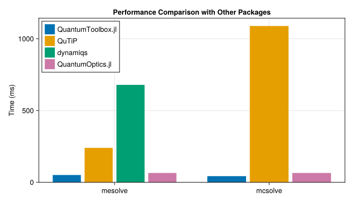

# Performance Comparison of Quantum Simulation Packages: Julia
vs. Python
Alberto Mercurio

Here we compare the performance of
[`QuantumToolbox.jl`](https://github.com/qutip/QuantumToolbox.jl) with
other quantum simulation packages: -
[`QuTiP`](https://github.com/qutip/qutip) (Python) -
[`dynamiqs`](https://github.com/dynamiqs/dynamiqs) (Python - JAX) -
[`QuantumOptics.jl`](https://github.com/qojulia/QuantumOptics.jl)
(Julia)

To allow reproducibility, this page is generated with
[`Quarto`](https://quarto.org) based on [this
repository](https://github.com/albertomercurio/QuantumToolbox-Benchmarks).
Moreover, to keep the code clean, we use the
[`PythonCall.jl`](https://github.com/JuliaPy/PythonCall.jl) package to
call Python code from Julia. We tested that the overhead of calling
Python code from Julia is negligible for the purpose of this benchmark.

## Importing the Required Packages

``` julia
import QuantumToolbox
import QuantumOptics
using CairoMakie
using PythonCall
using BenchmarkTools

np = pyimport("numpy")
qutip = pyimport("qutip")
jax = pyimport("jax")
jnp = jax.numpy
dynamiqs = pyimport("dynamiqs")

dynamiqs.set_device("cpu")
dynamiqs.set_precision("double") # Se the same precision as the others
```

    Python: None

## Master Equation simulation

Parameters:

``` julia
N = 50
Δ = 0.1
F = 2
γ = 1
nth = 0.8
```

    0.8

### QuantumToolbox.jl

``` julia
a = QuantumToolbox.destroy(N)
H = Δ * a' * a + F * (a + a')
c_ops = [sqrt(γ * (1 + nth)) * a, sqrt(γ * nth) * a']

tlist = range(0, 10, 100)
ψ0 = QuantumToolbox.fock(N, 0)

QuantumToolbox.mesolve(H, ψ0, tlist, c_ops, progress_bar = Val(false)).states[2] # Warm-up

mesolve_quantumtoolbox = @benchmark QuantumToolbox.mesolve($H, $ψ0, $tlist, $c_ops, progress_bar = Val(false)).states[2]
```

    BenchmarkTools.Trial: 99 samples with 1 evaluation.
     Range (min … max):  50.056 ms …  57.099 ms  ┊ GC (min … max): 0.00% … 10.40%
     Time  (median):     50.666 ms               ┊ GC (median):    0.68%
     Time  (mean ± σ):   50.870 ms ± 988.354 μs  ┊ GC (mean ± σ):  0.66% ±  1.52%

        ▃█▂▄                                                        
      ▄▅████▆█▆▃▃▆▃▅▁▃▁▁▃▁▁▁▁▁▁▁▁▁▁▁▁▁▁▁▁▁▁▁▁▁▁▁▁▁▁▁▁▁▁▁▁▁▁▁▁▁▁▁▁▃ ▁
      50.1 ms         Histogram: frequency by time           57 ms <

     Memory estimate: 7.42 MiB, allocs estimate: 789.

### QuTiP

``` julia
a = qutip.destroy(N)
H = Δ * a.dag() * a + F * (a + a.dag())
c_ops = pylist([np.sqrt(γ * (1 + nth)) * a, np.sqrt(γ * nth) * a.dag()])

tlist = np.linspace(0, 10, 100)
ψ0 = qutip.fock(N, 0)

qutip.mesolve(H, ψ0, tlist, c_ops).states[1] # Warm-up

mesolve_qutip = @benchmark qutip.mesolve($H, $ψ0, $tlist, $c_ops).states[1]
```

    BenchmarkTools.Trial: 21 samples with 1 evaluation.
     Range (min … max):  231.789 ms … 250.944 ms  ┊ GC (min … max): 0.00% … 0.00%
     Time  (median):     238.013 ms               ┊ GC (median):    0.00%
     Time  (mean ± σ):   239.896 ms ±   6.504 ms  ┊ GC (mean ± σ):  0.00% ± 0.00%

      █       ▃        █                             ▃               
      █▁▁▇▁▁▁▁█▁▇▁▁▁▁▁▁█▁▇▇▁▇▁▁▁▁▁▁▁▁▇▁▁▁▁▁▁▁▁▁▁▁▁▁▁▇█▁▇▁▁▇▁▁▁▁▁▇▁▇ ▁
      232 ms           Histogram: frequency by time          251 ms <

     Memory estimate: 464 bytes, allocs estimate: 20.

### dynamiqs

``` julia
a = dynamiqs.destroy(N)
H = Δ * jnp.matmul(dynamiqs.dag(a), a) + F * (a + dynamiqs.dag(a))
c_ops = [jnp.sqrt(γ * (1 + nth)) * a, jnp.sqrt(γ * nth) * dynamiqs.dag(a)]

tlist = jnp.linspace(0, 10, 100)
ψ0 = dynamiqs.fock(N, 0)

dynamiqs.mesolve(H, c_ops, ψ0, tlist, options = dynamiqs.Options(progress_meter = nothing)).states # Warm-up

mesolve_dynamiqs =
    @benchmark dynamiqs.mesolve($H, $c_ops, $ψ0, $tlist, options = dynamiqs.Options(progress_meter = nothing)).states
```

    BenchmarkTools.Trial: 8 samples with 1 evaluation.
     Range (min … max):  502.796 ms … 744.718 ms  ┊ GC (min … max): 0.00% … 0.00%
     Time  (median):     696.402 ms               ┊ GC (median):    0.00%
     Time  (mean ± σ):   678.708 ms ±  73.167 ms  ┊ GC (mean ± σ):  0.00% ± 0.00%

      ▁                                              █▁█ ▁        ▁  
      █▁▁▁▁▁▁▁▁▁▁▁▁▁▁▁▁▁▁▁▁▁▁▁▁▁▁▁▁▁▁▁▁▁▁▁▁▁▁▁▁▁▁▁▁▁▁███▁█▁▁▁▁▁▁▁▁█ ▁
      503 ms           Histogram: frequency by time          745 ms <

     Memory estimate: 1.45 KiB, allocs estimate: 66.

### QuantumOptics.jl

``` julia
bas = QuantumOptics.FockBasis(N)
a = QuantumOptics.destroy(bas)

H = Δ * a' * a + F * (a + a')
c_ops = [sqrt(γ * (1 + nth)) * a, sqrt(γ * nth) * a']

tlist = range(0, 10, 100)
ψ0 = QuantumOptics.fockstate(bas, 0)

QuantumOptics.timeevolution.master(tlist, ψ0, H, c_ops)[2][2]

mesolve_quantumoptics = @benchmark QuantumOptics.timeevolution.master($tlist, $ψ0, $H, $c_ops)
```

    BenchmarkTools.Trial: 56 samples with 1 evaluation.
     Range (min … max):  87.165 ms … 94.442 ms  ┊ GC (min … max): 0.00% … 0.00%
     Time  (median):     89.542 ms              ┊ GC (median):    0.00%
     Time  (mean ± σ):   89.653 ms ±  1.219 ms  ┊ GC (mean ± σ):  0.13% ± 0.38%

                             ▂     █                               
      ▄▁▁▁▁▁▄▁▆▁▄▁█▁▁▁▁▆▁▁▁▆▆█▄▄▆▆▄█▄▁▆▄▁▄▄▄█▄▆▆▁▄▁▁▄▁▄▄▁▆▁▄▁▁▁▁▄ ▁
      87.2 ms         Histogram: frequency by time        91.9 ms <

     Memory estimate: 4.78 MiB, allocs estimate: 643.

## Monte Carlo quantum trajectories simulation

Parameters:

``` julia
N = 50
Δ = 0.1
F = 2
γ = 1
nth = 0.8
ntraj = 100
```

    100

### QuantumToolbox.jl

``` julia
a = QuantumToolbox.destroy(N)
H = Δ * a' * a + F * (a + a')
c_ops = [sqrt(γ * (1 + nth)) * a, sqrt(γ * nth) * a']

tlist = range(0, 10, 100)
ψ0 = QuantumToolbox.fock(N, 0)

QuantumToolbox.mcsolve(H, ψ0, tlist, c_ops, progress_bar = Val(false), ntraj = ntraj).states[2] # Warm-up

mcsolve_quantumtoolbox =
    @benchmark QuantumToolbox.mcsolve($H, $ψ0, $tlist, $c_ops, progress_bar = Val(false), ntraj = ntraj).states[2]
```

    BenchmarkTools.Trial: 117 samples with 1 evaluation.
     Range (min … max):  36.251 ms … 51.697 ms  ┊ GC (min … max): 0.00% … 0.00%
     Time  (median):     42.390 ms              ┊ GC (median):    0.00%
     Time  (mean ± σ):   42.868 ms ±  3.576 ms  ┊ GC (mean ± σ):  2.79% ± 3.63%

                █  ▄▆    ▂ ▆ ▄   █▄ ▂     ▂ ▂                      
      ▄▁█▁▁▁▆▆▁███▆███▁▆██▄█▆██▄▄██▆█▄▄▁▄▄█▆██▆▆▁▄█▁▁▄▁▁▄▄▁▄▁▄▄▁▆ ▄
      36.3 ms         Histogram: frequency by time        51.6 ms <

     Memory estimate: 13.24 MiB, allocs estimate: 31531.

### QuTiP

``` julia
a = qutip.destroy(N)
H = Δ * a.dag() * a + F * (a + a.dag())
c_ops = pylist([np.sqrt(γ * (1 + nth)) * a, np.sqrt(γ * nth) * a.dag()])

tlist = np.linspace(0, 10, 100)
ψ0 = qutip.fock(N, 0)

qutip.mcsolve(
    H,
    ψ0,
    tlist,
    c_ops,
    ntraj = ntraj,
    options = pydict(Dict("progress_bar" => false, "map" => "parallel", "num_cpus" => Threads.nthreads())),
).states[1] # Warm-up

mcsolve_qutip = @benchmark qutip.mcsolve(
    $H,
    $ψ0,
    $tlist,
    $c_ops,
    ntraj = ntraj,
    options = pydict(Dict("progress_bar" => false, "map" => "parallel", "num_cpus" => Threads.nthreads())),
).states[1]
```

    /home/alberto/anaconda3/lib/python3.11/multiprocessing/popen_fork.py:66: RuntimeWarning: os.fork() was called. os.fork() is incompatible with multithreaded code, and JAX is multithreaded, so this will likely lead to a deadlock.
      self.pid = os.fork()

    BenchmarkTools.Trial: 5 samples with 1 evaluation.
     Range (min … max):  1.065 s …   1.138 s  ┊ GC (min … max): 0.00% … 0.00%
     Time  (median):     1.081 s              ┊ GC (median):    0.00%
     Time  (mean ± σ):   1.089 s ± 28.231 ms  ┊ GC (mean ± σ):  0.00% ± 0.00%

      █       █   █  █                                        █  
      █▁▁▁▁▁▁▁█▁▁▁█▁▁█▁▁▁▁▁▁▁▁▁▁▁▁▁▁▁▁▁▁▁▁▁▁▁▁▁▁▁▁▁▁▁▁▁▁▁▁▁▁▁▁█ ▁
      1.07 s         Histogram: frequency by time        1.14 s <

     Memory estimate: 1.95 KiB, allocs estimate: 51.

### dynamiqs (not yet implemented)

### QuantumOptics.jl

``` julia
bas = QuantumOptics.FockBasis(N)
a = QuantumOptics.destroy(bas)

H = Δ * a' * a + F * (a + a')
c_ops = [sqrt(γ * (1 + nth)) * a, sqrt(γ * nth) * a']

tlist = range(0, 10, 100)
ψ0 = QuantumOptics.fockstate(bas, 0)

function quantumoptics_mcwf(tlist, ψ0, H, c_ops, ntraj)
    Threads.@threads for i in 1:ntraj
        QuantumOptics.timeevolution.mcwf(tlist, ψ0, H, c_ops, display_beforeevent = true, display_afterevent = true)[2][2]
    end
end

quantumoptics_mcwf(tlist, ψ0, H, c_ops, ntraj) # Warm-up

mesolve_quantumoptics = @benchmark quantumoptics_mcwf($tlist, $ψ0, $H, $c_ops, ntraj)
```

    BenchmarkTools.Trial: 78 samples with 1 evaluation.
     Range (min … max):  52.328 ms … 74.202 ms  ┊ GC (min … max):  0.00% … 14.67%
     Time  (median):     65.138 ms              ┊ GC (median):    10.45%
     Time  (mean ± σ):   64.884 ms ±  4.385 ms  ┊ GC (mean ± σ):  11.29% ±  3.72%

                                 ▅  ▅  █  ▅▅▅   ▅▂▂                
      ▅▁▁▁▁▅▁▅▁▁▁▅▁▁▅▅▁▁█▁▁▁▅▅██▁██▅█████▅█████▁███▅▅▅█▁▅▁▅▅▅█▁▅█ ▁
      52.3 ms         Histogram: frequency by time          73 ms <

     Memory estimate: 73.16 MiB, allocs estimate: 228253.

## Plotting the Results

``` julia
mesolve_times = [
    1e-6 * sum(m.times) / length(m.times) for
    m in [mesolve_quantumtoolbox, mesolve_qutip, mesolve_dynamiqs, mesolve_quantumoptics]
]
mcsolve_times =
    [1e-6 * sum(m.times) / length(m.times) for m in [mcsolve_quantumtoolbox, mcsolve_qutip, mesolve_quantumoptics]]

fig = Figure(size = (700, 400))
ax = Axis(
    fig[1, 1],
    xticks = (1:2, ["mesolve", "mcsolve"]),
    ylabel = "Time (ms)",
    title = "Performance Comparison with Other Packages",
)

colors = Makie.wong_colors()

barplot!(
    ax,
    ones(length(mesolve_times)),
    mesolve_times,
    dodge = 1:length(mesolve_times),
    color = colors[1:length(mesolve_times)],
)

barplot!(ax, 2 * ones(length(mcsolve_times)), mcsolve_times, dodge = 1:length(mcsolve_times), color = colors[[1, 2, 4]])

ylims!(ax, 0, nothing)

# Legend

labels = ["QuantumToolbox.jl", "QuTiP", "dynamiqs", "QuantumOptics.jl"]
elements = [PolyElement(polycolor = colors[i]) for i in 1:length(labels)]

axislegend(ax, elements, labels, position = :lt)

# save("package_comparison.png", fig, px_per_unit = 2.0)

fig
```



------------------------------------------------------------------------

## System Information

``` julia
using InteractiveUtils

versioninfo()
```

    Julia Version 1.11.1
    Commit 8f5b7ca12ad (2024-10-16 10:53 UTC)
    Build Info:
      Official https://julialang.org/ release
    Platform Info:
      OS: Linux (x86_64-linux-gnu)
      CPU: 32 × 13th Gen Intel(R) Core(TM) i9-13900KF
      WORD_SIZE: 64
      LLVM: libLLVM-16.0.6 (ORCJIT, alderlake)
    Threads: 16 default, 0 interactive, 8 GC (on 32 virtual cores)
    Environment:
      JULIA_PYTHONCALL_EXE = ../pyenv/bin/python
      LD_LIBRARY_PATH = /usr/local/lib:
      JULIA_NUM_THREADS = 16
      JULIA_CONDAPKG_BACKEND = Null
      JULIA_LOAD_PATH = @:@stdlib

------------------------------------------------------------------------

``` julia
QuantumToolbox.about()
```


     QuantumToolbox.jl: Quantum Toolbox in Julia
    ≡≡≡≡≡≡≡≡≡≡≡≡≡≡≡≡≡≡≡≡≡≡≡≡≡≡≡≡≡≡≡≡≡≡≡≡≡≡≡≡≡≡≡≡≡
    Copyright © QuTiP team 2022 and later.
    Current admin team:
        Alberto Mercurio and Yi-Te Huang

    Package information:
    ====================================
    Julia              Ver. 1.11.1
    QuantumToolbox     Ver. 0.22.0
    SciMLOperators     Ver. 0.3.12
    LinearSolve        Ver. 2.37.0
    OrdinaryDiffEqCore Ver. 1.12.1

    System information:
    ====================================
    OS       : Linux (x86_64-linux-gnu)
    CPU      : 32 × 13th Gen Intel(R) Core(TM) i9-13900KF
    Memory   : 62.514 GB
    WORD_SIZE: 64
    LIBM     : libopenlibm
    LLVM     : libLLVM-16.0.6 (ORCJIT, alderlake)
    BLAS     : libopenblas64_.so (ilp64)
    Threads  : 16 (on 32 virtual cores)

------------------------------------------------------------------------

``` julia
qutip.about()
```

    Python: None
